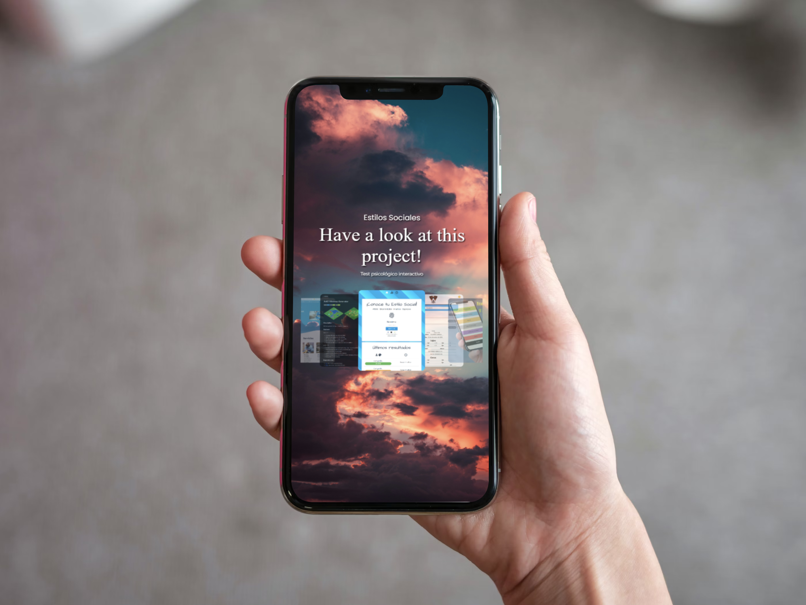

<p align="center">
    
</p>

<div align="center">

# Marfullsen Portfolio

[](https://materializecss.com/)

</div>

<p align="center">
  Landing page and portfolio for Marfullsen's projects.
</p>

> [!TIP]
> Feel free to explore the repository, you might find some Easter eggs along the way.

## About

<p align="center">
    
</p>

Welcome to my landing page and portfolio repository. This repository serves as a showcase of my skills, projects, and experiences in the IT industry. Here's what you can expect to find:

### About Me

A brief introduction about me and a comprehensive list of my technical skills, including programming languages, tools, and technologies that I'm proficient in.

<p align="center">
    
</p>

### Projects

A curated selection of my most notable projects, complete with descriptions, technologies used, and links to the project repositories or live demos. These projects demonstrate my ability to apply my skills to real-world problems and create innovative solutions.

<p align="center">
    
</p>

### Contact

Information on how to get in touch with me for collaborations, job opportunities, or any other inquiries.

<p align="center">
    
</p>

Feel free to navigate through this repository to learn more about my background, skills, and projects. I hope you find the information here helpful and engaging. I'm always open to new opportunities and collaborations, so don't hesitate to reach out.

> [!IMPORTANT]  
> Go to my LinkenIn profile for more details about my professional experience, including my roles, responsibilities, and achievements in previous positions.

<p align="center">
    
</p>

## To do

- [x] Design Aero interface.
- [x] Define the order of the contents. (About, Portfolio, Contact)
- [x] Chose my best project to showcase them.
- [x] Chose the best framework to help in the development. (Materialize)
- [x] Add animations and transitions.
- [ ] Add full trasnlation to Spanish, English and others instead of current Spaniglish.


## Run the project

Clone the repo

```bash
   git clone https://github.com/Marfullsen/Marfullsen.github.io.git
```

Go to the folder

```bash
   cd Marfullsen.github.io/
```

Using any extension like Open Five Server (Visual Studio Code), you'll be able to run a local development server, then you'll be able to open the site in the browser.

```bash
   http://127.0.0.1:5500/
```

## Screenshots

### home in mobile version

<p align="center">
    
</p>

### Easter Egg 1

<p align="center">
    
</p>

### Easter Egg 2

<p align="center">
    
</p>

## References
- [Background image by Szabo Viktor](https://unsplash.com/photos/white-sea-of-clouds-28ZbKOWiZfs)
- Mockups from [MockupBro](https://mockupbro.com/)